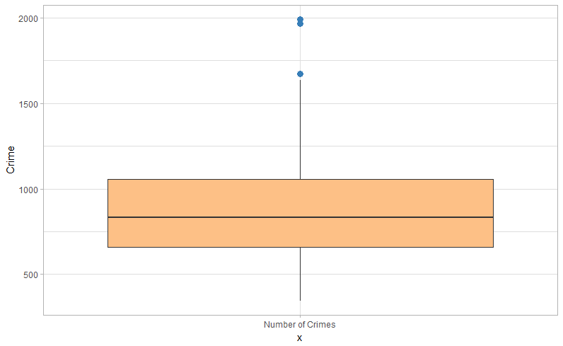

# Homework 3

## Questions 5.1
__Question:__ Using crime data from the file uscrime.txt (http://www.statsci.org/data/general/uscrime.txt,
description at http://www.statsci.org/data/general/uscrime.html), test to see whether there are any
outliers in the last column (number of crimes per 100,000 people). Use the grubbs.test function in
the outliers package in R

__Answer__: To get a feel for our data we can look at the summary and create a box-and-whiskers plot. 
```R
print(summary(crimes[, "Crime"]))
   Min. 1st Qu.  Median    Mean 3rd Qu.    Max. 
  342.0   658.5   831.0   905.1  1057.5  1993.0 
```  



From the plot it appears as though we _may_ have three outliers on the high side. This should peak our interst to investiage further. 
One definition of outlier related to the box-plot and summary is any value greater than 1.5\*IQR, where ```IQR = Q3-Q1```. 

```R
Q3 <- summary(crimes[, "Crime"])[5]

# generic way outliers are computed. What ggplot uses
num_of_outliers  <- sum(crimes[, "Crime"] > (1.5*Q3))  # output is 4
```
After running this code it suggests there are actually four outliers. This is the common way box-and-whiskers plots calculate 
outliers so we should not be surprised by the results. To further our investigation we can check to see if there is an abnormal 
or unexpected number of points past two standard deviations from the mean. Given a normal distribution, we expect 2.5% of our 
data to be above <strong>μ+2σ</strong> from the [empirical rule](https://en.wikipedia.org/wiki/68%E2%80%9395%E2%80%9399.7_rule). 
That is to say it's expected to see ```0.025 * 47 ≈ 1```. 

```R
sum(crimes[, "Crime"] > (sd(crimes[, "Crime"])*2 + mean(crimes[, "Crime"])))
# 2
```
There are two values more than two standard deviations above the mean where we only expected 1. That's not two crazy so perhaps 
there are no outliers. We can use ```grubbs.test``` to help us run a hypothesis test on if the maximum point is an outlier or not. 
Surely if one of the points at the end of the specturm is an outlier it would be the maximum point. 

```R
gt <- outliers::grubbs.test(
  crimes[, "Crime"], 
  type = 10,  # test for an outlier on the high side. 
  opposite = FALSE, 
  two.sided = FALSE
)

print(gt$alternative)
print(gt$p.value)
```
Which gives us:
```sh
> print(gt$alternative)
[1] "highest value 1993 is an outlier"
> print(gt$p.value
+ )
[1] 0.07887486
```
Using the standard but arbitrary ```alpha = 0.05``` we fail to reject our null hypothesis, which means we cannot 
accept our alternative hypothesis above. In not statistics talk, this test says there are not any outliers. Considering 
all these points are just beyond 1.5\*IQR, 2σ, and the grubbs test failed to reject the null hypothesis __I conclude 
there are no outliers in this column__. This means I would use all of these data points in my analysis. 

## Question 6.1
__Question:__ Describe a situation or problem from your job, everyday life, current events, etc., for which a Change
Detection model would be appropriate. Applying the CUSUM technique, how would you choose the
critical value and the threshold?

__Answer:__ CUSUM and change detection is a fundamental way of running a factory. 
[Control charts](http://asq.org/learn-about-quality/data-collection-analysis-tools/overview/control-chart.html) 
are common practice to ensure machines don't overload, processes aren't disrupted, and throughput is optimized. 
There are endless example similar to the microchip example from the lecture videos. More interesting to me is 
how airline companies use sensors to monitor the status of their planes, much like the train example from class. 
Airplanes are catastrophic if one breaks in the air, and expensive to have them out of commision for extended periods 
between flights. It is often far cheaper and faster to replace them between flights before a complete failure. 
However, plane components are expensive and air line companies opperate on low margins, so replacing parts too 
often can also cause problems. Since planes cool off and are inspected between flights, we can expect less 
failure rates at the beggining of a flight as opposed to the end of a flight. Thus, we could set the time (T) 
to check in more often over the duration of the flight. Each part/sensor would have its own threshold and 
critical value dependion on how paramount it is to flight, but I would assume the critical value would be set 
low. A false positive is a far greater alternative to having a plane fall out of the sky. 

## Question 6.2 
__Question(s):__
  1. Using July through October daily-high-temperature data for Atlanta for 1996 through 2015, use
a CUSUM approach to identify when unofficial summer ends (i.e., when the weather starts
cooling off) each year. You can get the data that you need from the file temps.txt or online,
for example at http://www.iweathernet.com/atlanta-weather-records or
https://www.wunderground.com/history/airport/KFTY/2015/7/1/CustomHistory.html . You can
use R if you’d like, but it’s straightforward enough that an Excel spreadsheet can easily do the
job too.
  2. Use a CUSUM approach to make a judgment of whether Atlanta’s summer climate has gotten
warmer in that time (and if so, when).

__Answer__: in progress
