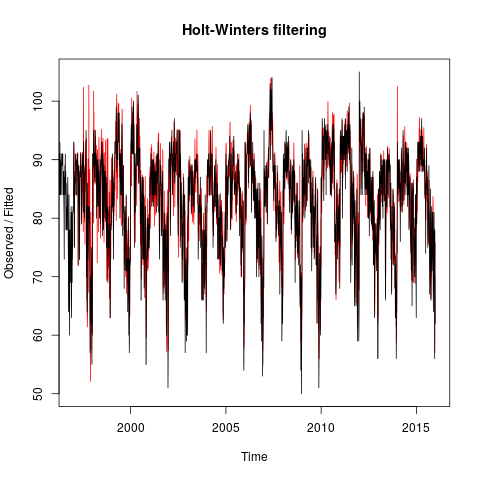
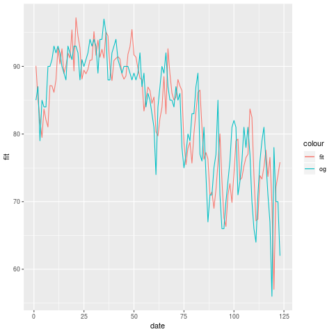
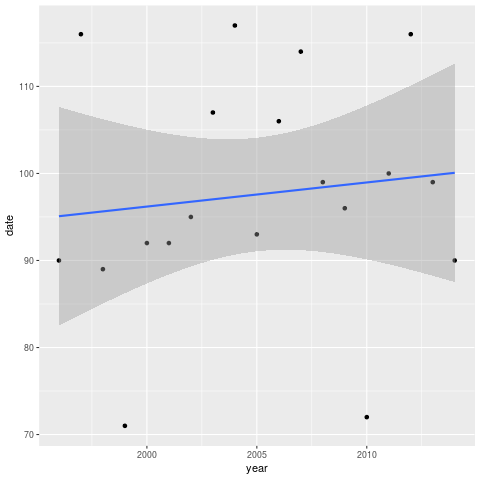

# Homework 4

# Question 7.1
**Question:** Describe a situation or problem from your job, everyday life, current events, etc., for which exponential
smoothing would be appropriate. What data would you need? Would you expect the value of α (the
first smoothing parameter) to be closer to 0 or 1, and why?

**Answer:** At my job we create performance management applications to monitor specific business lines. 
One of the business lines we monitor is hospital performance. One major thing we track is the infection 
ration inside the ICU & different wards. The data would be the number and percent of people in the 
hospital that have or got an infection since entering the hospital. It's important to keep this in 
check and avoid a large outbreak across the hospital. Since infections are mostly easy to identify 
and are being reported by doctors we generally assume little noise in the data which means we'd try to 
use a larger alpha closer to 1. In addition, in hospitals nurses are constantly checking in with 
patients and verifying information. This redundant checking, and importance of subject matter 
generally leads to low amounts of noise.

# Question 7.2
**Question:** Using the 20 years of daily high temperature data for Atlanta (July through October) from Question 6.2
(file ```temps.txt```), build and use an exponential smoothing model to help make a judgment of whether
the unofficial end of summer has gotten later over the 20 years. (Part of the point of this assignment is
for you to think about how you might use exponential smoothing to answer this question. Feel free to
combine it with other models if you’d like to. There’s certainly more than one reasonable approach.)
Note: in R, you can use either ```HoltWinters``` (simpler to use) or the ```smooth``` package’s ```es``` function
(harder to use, but more general). If you use es, the Holt-Winters model uses ```model=”AAM”``` in the
function call (the first and second constants are used “A”dditively, and the third (seasonality) is used
“M”ultiplicatively; the documentation doesn’t make that clear).

**Answer:** As always, we'll start buy loading some libraries we'll need, loading the data and reviewing it. 
This helps us get a feel for the data and problem shoot the task ahead.

```R
library(smooth)  # for general HoltWinters
library(ggplot2)  # to visualize results
library(reshape2)  # melt dataframe

# Read in the data
temps <- read.table(
  "temps.txt", 
  sep="\t", 
  header=TRUE
)

# look at how the data looks
print(head(temps))
```
To check if seasonality is getting later over time we can start by smoothing out our data to 
remove noise that may be occuring in any given year. We can use the following code to 
[melt](http://r4ds.had.co.nz/tidy-data.html#spreading-and-gathering) our dataframe and make one long 
time series object, _ts_. 


```R

L <-  nrow(temps)  # constant L to be using in seasonality
# Melt dataframe because we're going to use it as one long time-series
m_temps <- reshape2::melt(temps)
m_temps <- m_temps[with(m_temps, order(variable)), ]  # sort the data.
print(head(m_temps))  # show the changes we made by melting.
rownames(m_temps) <- 1:nrow(m_temps)  # not needed, but I a clean axis.

ts_temps <- ts(as.vector(m_temps[, "value"]), start = 1996, frequency = L )
```

Now that we have a time series object we can run Holt-Winters on it to create an exponentially smoothed 
version of our data.

```R
hw_model <- HoltWinters(
  ts_temps,
  alpha = NULL,
  beta = NULL,
  gamma = NULL, 
  seasonal = "multiplicative", 
  #optim.start = c(alpha=0.7, beta = 0.1, gamma=0.15)
)
```       
Let's check how well our time series fit the data.



Looks pretty good, but viewing 20 years at once is kind of hard to tell. Let's zoom in at the last 
year just to do a sanity check. 



Yup, looks pretty close. We would expect it to be slightly off from error in the system. Now we can 
use the **CUSUM** method from last week to find our unofficial end of summer days and check to see 
if they are getting later. My function grabs the index of the date it calculates as the last date of 
summer. Thus, an answer of ```90``` is two days before an answer of ```92``` and can be turned into 
a date by ```temps[90, 1] = 21-Sept```. Now let's look at how we can code this. 


```R
new_matrix <- cbind(round(as.vector(time(hw_model$fitted))),
as.vector(hw_model$fitted[, 'xhat']))

# 1996 - 2015
for (i in 2:20) {
  start <- (i-2)*123+1  
  end <- (i-1)*123
  temps[, i] <- new_matrix[c(start:end), 2]
  print(start)
}

# for some reason having trouble populating the last column
temps <- temps[, -21]
print(head(temps))

## now take our results and use the CUSUM to test for end of summer
## with smoothed out results

# CUSUM function
cusum <- function(my_vector, threshold = 100, C = 0, type="high"){
  # Type - high/low, what we are looking for. 
  # higher change or lower change. 
  # threshold, is our threshold
  # C - correction value. 
  
  # error handling, input an option?
  if (!(type %in% c("low", "high"))){
    print("type is not low or high")
    stop()
  }
  output <- 0
  n = length(my_vector)
  # for each time step
  for (t in 2:n){
    # use rolling avg. because if it was the real world we wouldn't know 
    # future points to use them in our average.
    mu <- mean(my_vector[1:t])  # rolling avg. 
    if (type == "high"){
      # CUSUM formula: st = max{0, s(t-1) + (xt - mu - C)}
      deltas <- my_vector[1:t] - mu - C
    } else {
      # CUSUM formula: st = max{0, s(t-1) + (mu - xt - C)}
      deltas <- mu - my_vector[1:t]  - C
    }
    
    st = max(0, deltas[1])
    for (i in 2:t){
      st <- max(0, st + deltas[i] )
    }
    
    # check if pasted the threshold
    if (st >= threshold){
      print(paste("CUSUM over threshold @", t))
      output <- t
      break
    }
  }
  return(output) # 0 if never go over threshold. 
}


# now to figure out a proper C & threshold. 80 looks about good. 
# test <- cusum(climate_data[, 3], threshold = 86, C = 5, type="low")

indices <- rep(0, 19)  # initiate vector
for (year in 2:20){
  output <- cusum(
    temps[, year], 
    threshold = 41, 
    C = 6, 
    type="low"
  )
  
  indices[year - 1] <- output
  first_date <- temps[output, 1]
  print(first_date)
}
```

Now plotting these indices against the year they are from, we can fit a trend line to see if 
the numbers are increasing. If they are, then that would imply summer is ending later each 
year. 



The trend line appears to be positive! 
However, this must be taken with a grain of salt. The change is over 20 years, 
it appears to be less than a week, and there is definitely a lot of variance, randomness, 
and/or noise in our results here. The confidence interval of the potential true value of our 
trend line includes the value it started at, 95, which means it may have not changed over time. 
I would have to say either our data is inconclusive or that summer is ***not*** ending later
and later over time.
