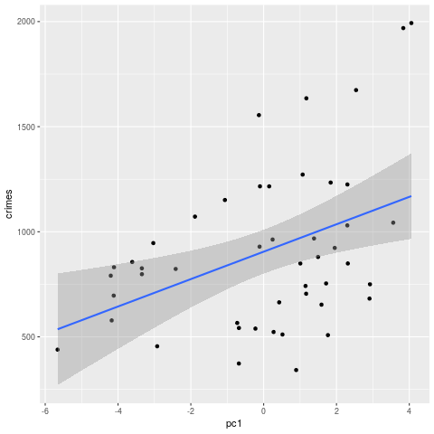

# Homework 5 - Linear Regression

## Question 8.1
**Question:**
Describe a situation or problem from your job, everyday life, current events, etc., for which a linear
regression model would be appropriate. List some (up to 5) predictors that you might use.

**Answer:**  A example that is always used is forecasting revenues. You can use previous sales, sales growth, 
number of new products being released, number of new markets you plan to enter, and mean price of products. 
Another example could be predicting the number of "likes" someone will get on a Facebook post. You could use 
  1. number of friends 
  2. number of words in post
  3. numbe of likes on previous post
  4. day of the week of the post
  5. their age (young people are assumed to be more active)
  6. number of posts

## Question 8.2
Using crime data from http://www.statsci.org/data/general/uscrime.txt (file uscrime.txt,
description at http://www.statsci.org/data/general/uscrime.html ), use regression (a useful R function is
lm or glm) to predict the observed crime rate in a city with the following data:

```
M       = 14.0
So      = 0
Ed      = 10.0
Po1     = 12.0
Po2     = 15.5
LF      = 0.640
M.F     = 94.0
Pop     = 150
NW      = 1.1
U1      = 0.120
U2      = 3.6
Wealth  = 3200
Ineq    = 20.1
Prob    = 0.04
Time    = 39.0
``` 
Show your model (factors used and their coefficients), the software output, and the quality of fit.<br><br>
**Note** that because there are only 47 data points and 15 predictors, you’ll probably notice some
overfitting. We’ll see ways of dealing with this sort of problem later in the course.


**Answer:** We're going to read in the US Crime data and use multiple linear regression to see if we are able 
to make a simple prediction on a new point. Beacuse we do not have that many points compared to features the 
best way to estimate our error is to use Leave One Out Cross Validation (LOOCV). See below:

```R
crimes <- read.table("uscrime.txt", header=T)

my_fit <- glm(Crime~., data=crimes)

#LOOCV - Because there aren't enough points for 10-fold Cv or even 5
cv.glm(crimes, my_fit)$delta  # result = 75308.54
```

Kind of hard to interpret the LOOCV when not comparing it 
to another model but this is pretty bad for onl 46 points. 
Highly likely we could do better once we perform some model 
selection like forward/backward/stepwise or Lasso Regression. 
Also, possible to perform PCA to ensure orthogonal features. 
Those are comming in a future homework so I'll wait on them. 
Feels weird with such a short homework. Our error is ~MSE.
Some people like to look at RMSE because it puts the error 
on the same order as the response (generally). for us, that 
Would be, 275.424. This does not imply our average error is 
275. A common miss-interpretation. 

Let's take a quick look at the features to see if we can 
Remove some. 

```R
print(summary(my_fit))
Call:
glm(formula = Crime ~ ., data = crimes)

Deviance Residuals: 
    Min       1Q   Median       3Q      Max  
-395.74   -98.09    -6.69   112.99   512.67  

Coefficients:
              Estimate Std. Error t value Pr(>|t|)    
(Intercept) -5.984e+03  1.628e+03  -3.675 0.000893 ***
M            8.783e+01  4.171e+01   2.106 0.043443 *  
So          -3.803e+00  1.488e+02  -0.026 0.979765    
Ed           1.883e+02  6.209e+01   3.033 0.004861 ** 
Po1          1.928e+02  1.061e+02   1.817 0.078892 .  
Po2         -1.094e+02  1.175e+02  -0.931 0.358830    
LF          -6.638e+02  1.470e+03  -0.452 0.654654    
M.F          1.741e+01  2.035e+01   0.855 0.398995    
Pop         -7.330e-01  1.290e+00  -0.568 0.573845    
NW           4.204e+00  6.481e+00   0.649 0.521279    
U1          -5.827e+03  4.210e+03  -1.384 0.176238    
U2           1.678e+02  8.234e+01   2.038 0.050161 .  
Wealth       9.617e-02  1.037e-01   0.928 0.360754    
Ineq         7.067e+01  2.272e+01   3.111 0.003983 ** 
Prob        -4.855e+03  2.272e+03  -2.137 0.040627 *  
Time        -3.479e+00  7.165e+00  -0.486 0.630708    
---
Signif. codes:  0 '***' 0.001 '**' 0.01 '*' 0.05 '.' 0.1 ' ' 1

```

There does appear that we can remove some of the features. But which ones? 
Without getting to detailed on the why until we get to model selection, I'm 
going to use backward model selection to see if e can create a better model. 

```R
slim_lm <- step(my_fit, direction = "backward")

print(slim_lm$anova)  # Check out who was kept!

cv.glm(crimes, slim_lm)$delta  # results = 48661.19 
```
We can look at the ANOVA table to see if we were able to minimize our AIC.

```sh
      Step Df    Deviance Resid. Df Resid. Dev      AIC
1          NA          NA        31    1354946 650.0291
2     - So  1    28.57405        32    1354974 648.0301
3   - Time  1 10340.66984        33    1365315 646.3874
4     - LF  1 10533.15902        34    1375848 644.7486
5     - NW  1 11674.63991        35    1387523 643.1457
6    - Po2  1 16706.34095        36    1404229 641.7082
7    - Pop  1 22345.36638        37    1426575 640.4503
8 - Wealth  1 26493.24677        38    1453068 639.3151
```
Yup our AIC looks like we were able to minimize it when we used 8 features.
In addition, we were able to decrease our LOOCV error to `48,661.19` which 
is a decent increase in accuracy.  linear model fits the data better now. 

We can now use our model to predict our new point.
```R
sample <- c(
            14.0,
            0,
            10.0,
            12.0,
            15.5,
            0.640,
            94.0,
            150,
            1.1,
            0.120,
            3.6,
            3200,
            20.1,
            0.04,
            39.0
          )

crimes <- rbind(crimes, sample)

print(
  paste(
    "Predicted crimes for sample: ", 
    predict(my_fit, newdata=crimes[nrow(crimes), ] )  # 115 point something
  )
)

```

So our final result is **"Predicted crimes for sample:  155.434896887448"**.

You cannot make one chart to graph crimes agains all of your features so I used 
PCA where each column of of our rotated matrix is a linear combination of the original 
matrix and thus has a little information of all the inputs. It also allows me to plot the 
first principal component against crimes and overlay a simple linear model using ggplot. 

```R
PCA_crimes <- prcomp(
  crimes[c(1:(nrow(crimes)-1)), c(1:(ncol(crimes)-1))], 
  center = T,
  scale = T
)

plot_df <- cbind(PCA_crimes$x[, 1], crimes[-nrow(crimes), ncol(crimes)])
colnames(plot_df) <- c('pc1', 'crimes')

p <- ggplot(as.data.frame(plot_df), aes(x=pc1, y=crimes)) + geom_point() +
  geom_smooth(method="lm")
png("linear_regression.png")
plot(p)
dev.off()
```


