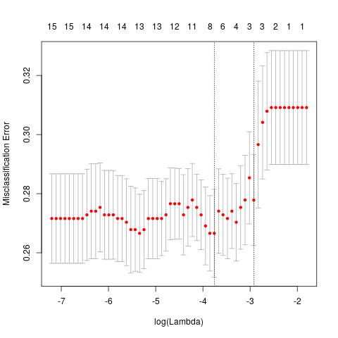

# Homework 7 - Advanced Regression

## Question 10.1
Using the same crime data set uscrime.txt as in Questions 8.2 and 9.1, find the best model you can
using:

<ol type="a">
  <li>Regression tree model</li>
  <li>Random forest model</li>
</ol> 

In R, you can use the tree package or the `rpart` package, and the `randomForest` package. For
each model, describe one or two qualitative takeaways you get from analyzing the results (i.e., don’t just
stop when you have a good model, <em>but interpret it too</em>).  

#### Answer - Part 1
After trying some different parameters I determined that the standard minimum amount of calues in a node to split 
was twenty. Given our small sample size, this will generate a shallow tree. After using `rpart` we find that there 
were only three splits created when regressing on our small sample. 

```sh
Regression tree:
rpart(formula = Crime ~ ., data = df, method = mthd, control = rpart.control(minsplit = min_split, 
    cp = my_cp))

Variables actually used in tree construction:
[1] NW  Po1 Pop

Root node error: 6880928/47 = 146403

n= 47 

        CP nsplit rel error  xerror    xstd
1 0.362963      0   1.00000 1.07393 0.26704
2 0.148143      1   0.63704 1.00044 0.23197
3 0.051732      2   0.48889 0.96193 0.20397
4 0.005000      3   0.43716 0.96513 0.20432
```
You can see in the above output that the lowest cross-validation error is on our model with three splits. 
We can prune our tree, or in this case select the deepest model to obtain our _optimal tree_.  We consider 
this to be our best tree based on its cross-validation error not the relative error.  It's important to 
prune our model, especially if we allow many splits, to avoid overfitting the data.  Thus, our final model 
is the following:


```sh
node), split, n, deviance, yval
      * denotes terminal node

1) root 47 6880928.0  905.0851  
  2) Po1< 7.65 23  779243.5  669.6087 *
  3) Po1>=7.65 24 3604162.0 1130.7500  
    6) NW< 7.65 10  557574.9  886.9000 *
    7) NW>=7.65 14 2027225.0 1304.9290 *
```

Origonally, the largest variance amount outputs was among `NW`, `Po1`, and `Pop`. which is why they were 
used to create the model. After pruning, we only use `Po1` and `NW`. These appear to be the only features 
required to make a decent tree.  the cutoffs are first in `Po1` at 7.65.  Then again for `NW` at 7.65 if 
`Po1 >=7.65`.  We can visualize this sectioning with the following figure:


If we use this model to predict we'll end up with only three possible outcomes. This may seem weird but 
if we were to have a perfect descision tree all the samples falling into one leaf would be flat or the 
same value. Thus,  our lowest error comes from prediction all points to be one of three values (four if 
we don't have complete information and have to average). The prediction vs. residual plot shows us 
the distribution of our errors for each prediciton. Based on the 47 points we used to build the model. 
Notice how the distribution in the middle is more compact or slim the the extrema. This is similar for 
OLS or other linear models. 


#### Helpful Links 
  1. [Stat methods - CART](https://www.statmethods.net/advstats/cart.html)
  2. [R2D3](http://www.r2d3.us/visual-intro-to-machine-learning-part-1/)

#### Code:
```R
create_reg_tree <- function(df, mthd='anova', min_split=20, my_cp=0.01 ){
  'Create and run a regression tree (CART)'
  require(rpart)
  if (class(df) != 'data.frame') {
    df <- as.data.frame(df)
  }
  # minesplit: requires that the minimum number of observations in a node be 
  # 30 before attempting a split
  # cp:  a split must decrease the overall lack of fit by a factor of 0.001 
  # (cost complexity factor) before being attempted.
  model <- rpart(
    formula = Crime ~ .,
    data = df,
    method = mthd,
    control = rpart.control(
      minsplit = min_split,  # default 20
      cp = my_cp      # default 0.01
    )
  )
  
  
  plot(model)
  text(model)  
  print(model)
  plot(predict(model), residuals(model))
  
  printcp( model )    # print cross validation errors xerror
  #plotcp( model )    # plot cv errors against cp value
  #rsq.rpart( model ) # approx. R-squared
  #summary( model )   # detailed results
  
  # pick the best cp i.e. best model:
  cp_optimal <- model$cptable[which.min(model$cptable[, "xerror"]),"CP"]
  optimal_tree <- prune(model, cp = cp_optimal)
  
  cat("\n", "Optimal Tree", "\n")
  print(optimal_tree)
  plot(predict(optimal_tree), residuals(optimal_tree))
  plot(optimal_tree, uniform = T, main = "Pruned Tree")
  text(optimal_tree, use.n = TRUE, all = TRUE, cex = 0.8)
  
}

uscrime_df <- read.table(
  'uscrime.txt',
  header = TRUE
)

create_reg_tree(df = uscrime_df, my_cp = 0.005)


library(ggplot2)
p <- ggplot(uscrime_df, aes(x = Po1, y = NW)) + 
  geom_point(color = 'darkblue', size = 3) +
  geom_vline(xintercept = 7.65, linetype="dashed", 
             color = "#d95f02", size=2) +
  geom_segment(aes(x = 7.65, y = 7.65, xend = 16.5, yend = 7.65), 
               size=2, linetype="dashed", color= "#1b9e77")
p  # show plot
```

#### Answer - Part 2

One way to view Creating a random forest is just creating many decision trees to average out the randomness. 
My thought process for growing trees was to grow 
10x the number of points we can expect all points will be used
multiple times while still not wasting time recomputing trees. We expect
tress to be shallow so we'll most likely have many repeats. Random forest
models can be computationally expensive and saving time growing trees can
greatly reduce the number time to compute. That's why I don't use 500 or
more trees.  In addition, I didn't want to use more than 3-5 features since the tree I built in part 1 only 
had three features. This is obviously to avoid overfitting the data. We find that we are able to account for 
just over 42% of the variance. This is much better than just a single tree which explained about 10% of the 
variance. If we build more than 470 trees, we start to see the error plataeu out. This is because we run out 
of unique trees we're able to build. Occam's razor tells us to simplify it down to fewer trees and avoid the 
redundancy. The random forest averages the results of the many trees which are easy to get predictions from 
after they are built since they are just a lookup. 

#### Helpful Links

  1. [Code Documentation](https://cran.r-project.org/web/packages/randomForest/randomForest.pdf)
  2. [Data Science Plus](https://datascienceplus.com/random-forests-in-r/)
  3. [Hastie & Tibshirani](https://www.r-bloggers.com/in-depth-introduction-to-machine-learning-in-15-hours-of-expert-videos/#chapter8treebasedmethodsslideshttpsclassstanfordeduc4xhumanitiessciencestatlearningassettreespdfplaylisthttpswwwyoutubecomplaylistlistpl5da3qgb5ib23tlua8zgvgc8hv8zadgh)


#### Code:
```R
create_rand_forest <- function(data, num_trees=500, m_try=5){
  require(randomForest)
  if (class(data) != 'data.frame') {
    data <- as.data.frame(data)
  }
  fit <- randomForest(
    x = data[, -ncol(data)], 
    y = data[, ncol(data)], 
    ntree =  num_trees,
    mtry = m_try
  )
  
  print(fit)
  png("myRandomForestError.png")
  plot(fit)
  dev.off()
  
}

uscrime_df <- read.table(
  'uscrime.txt',
  header = TRUE
)

##  I tried mtry=3, 4, 5 and 4 explained the most variance at 42%.
create_rand_forest(uscrime_df, 470, 4)  
```

<h2>Question 10.2</h2>  
Describe a situation or problem from your job, everyday life, current events, etc., for which a logistic
regression model would be appropriate. List some (up to 5) predictors that you might use.<br>

**Answer:** You could use logistic regression to do a binary classification of whether a candidate will win 
a political race. For example, will a candidate win a Senate position for a given state. One could use the 
following features to help them make this predictions: 

  1. Percent of registered voters in the state of the same political party
  2. Boolean if the candidate is the incumbent
  3. Number of rallies attended or hosted
  4. Total dollars raised 
  5. Average number or socal media posts a week/month
  6. prior approval ratings if available
  7. Age

<h2>Question 10.3</h2>

  1. Using the GermanCredit data set `germancredit.txt` from
    [here](http://archive.ics.uci.edu/ml/machine-learning-databases/statlog/german) (
    [description](http://archive.ics.uci.edu/ml/datasets/Statlog+%28German+Credit+Data%29)
    ), use logistic
    regression to find a good predictive model for whether credit applicants are good credit risks or
    not. Show your model (factors used and their coefficients), the software output, and the quality
    of fit. You can use the `glm` function in R. To get a logistic regression (logit) model on data where 
    the response is either zero or one, use `family=binomial(link="logit")` in your glm
    function call.

  2. Because the model gives a result between 0 and 1, it requires setting a threshold probability to
    separate between “good” and “bad” answers. In this data set, they estimate that incorrectly
    identifying a bad customer as good, is 5 times worse than incorrectly classifying a good
    customer as bad. Determine a good threshold probability based on your model.

#### Answer - Part 1

I am using glmnet instead of glm because the lasso regression is built in and a 
great way to perform model/feature selection to improve accuracy. 

```R
library(glmnet)

credit <- read.table(
  'germancredit.txt', 
  stringsAsFactors = FALSE, 
  header = TRUE
)

# Helper function to do one hot encoding
factor_to_binary <- function(data, col){
  'assuming the entries in the column are all strings. Not checking this but
  should in the future if you have more time to come back and add asserts'

  distinct_vals <- unique(data[, col])
  for (val in distinct_vals) {
    data[[val]] <- (data[, col] == val) + 0 # make numeric
  }

  data[, col] <- NULL

  return(data)
}

# new data let's get a look
print( head( credit ) )

response_name <- colnames(credit)[ncol(credit)]

# find whichcolumns are factors or strings
char_cols_check <- lapply(credit, typeof) == 'character'
char_cols <- colnames(credit)[char_cols_check]

# one hot encode all categorical variables. 
for (name in char_cols){
  credit <- factor_to_binary(credit, name)
}

train_idx <- sample(
  1:nrow(credit),
  round(0.8*nrow(credit)),
  replace=FALSE
)

# create Response vector and feature matrix
X = credit[train_idx, setdiff(names(credit), c(response_name))]
Y = credit[train_idx, response_name]

x_test = credit[-train_idx, setdiff(names(credit), c(response_name))]
y_test = credit[-train_idx, response_name]

Y <- Y - 1  # (0 & 1) instead of (1 & 2)
y_test <- y_test - 1

# Glmnet only takes a matrix as input. 
# this should help performance anyway
# matrices are smaller (memory) and consistent (one data type)
X <- as.matrix(X)
Y <- as.matrix(Y)
x_test <- as.matrix(x_test)
y_test <- as.matrix(y_test)
# 1. create a model
# using glmnet 
fit = glmnet(
  x = X, 
  y = Y, 
  family = "binomial"
)
# 2. Check how well the model fits
print(fit)  
yhat <- predict(fit, newx = x_test, type = "class", s = 0) # s=0 is reg logit
misclass_err <- sum(abs(as.numeric(yhat)-y_test))/nrow(y_test)
cat("\n","Misclassification error of logit fit: ", misclass_err, "\n", sep="")
```
Here are the results from the code above:
```sh
Call:  glmnet(x = X, y = Y, family = "binomial", standardize = FALSE) 

      Df       %Dev Lambda
 [1,]  0 -9.500e-15 213.40
 [2,]  1  3.381e-03 194.40
 [3,]  1  6.138e-03 177.20
 [4,]  1  8.395e-03 161.40
 [5,]  1  1.025e-02 147.10
 [6,]  1  1.178e-02 134.00
 [7,]  1  1.304e-02 122.10
 [8,]  1  1.408e-02 111.30
 [9,]  1  1.494e-02 101.40
[10,]  1  1.565e-02  92.38
[11,]  1  1.624e-02  84.17
[12,]  1  1.673e-02  76.69
[13,]  1  1.714e-02  69.88
[14,]  1  1.748e-02  63.67
[15,]  1  1.776e-02  58.02
[16,]  1  1.799e-02  52.86
[17,]  1  1.819e-02  48.17
[18,]  1  1.835e-02  43.89
[19,]  1  1.848e-02  39.99
[20,]  1  1.859e-02  36.44
[21,]  1  1.869e-02  33.20
[22,]  1  1.876e-02  30.25
[23,]  1  1.883e-02  27.56
[24,]  1  1.888e-02  25.11
[25,]  1  1.892e-02  22.88
[26,]  1  1.896e-02  20.85
[27,]  1  1.899e-02  19.00
[28,]  1  1.902e-02  17.31
[29,]  1  1.904e-02  15.77
[30,]  1  1.905e-02  14.37
[31,]  1  1.907e-02  13.09
[32,]  1  1.908e-02  11.93
[33,]  1  1.909e-02  10.87

Misclassification error of logit fit: 0.265
```
So 26.5% error is the goal to beat, which isn't that good. 
We can use cross validation to create a better model.

```R
cvfit = cv.glmnet(
  x = X, 
  y = Y, 
  family = "binomial", 
  type.measure = "class",  # misclassification error
  nfolds = 10
)
# create an error of the plots
png('logistic_cv_error.png')
plot(cvfit)
dev.off()
```
We can see how our error changes in the following graph. It shows lambda for 
the lasso regression across the bottom, number of non-zero coefficients 
across the top and the error on the y axis.



Let's check out our coefficents for the model with the lowest error
```R
coef(cvfit, s = 'lambda.min')
```

You can see that the cross validation removes most of our variables we added
by one hot encoding.  

```R
yhat <- predict(cvfit, newx = x_test, s = "lambda.min", type = "class")
misclass_err2 <- sum(abs(as.numeric(yhat)-y_test))/nrow(y_test)
cat("\n","Misclassification error of logit fit: ", misclass_err2, "\n", sep="")
```

results on the test set are...
about 26.5% for our original logistic model and our sparsed out model.
we could try performing more perprocessing on our data to see if it would
improve results. We shouuld also, most likely standardize our new x values when we 
go to predict on them. This may help us increase accuracy as well. However, 75% is 
not too bad.

#### Helpful links:

  1. [Stanford](https://web.stanford.edu/~hastie/glmnet/glmnet_alpha.html#log)
  2. [ML cheatsheet](https://ml-cheatsheet.readthedocs.io/en/latest/logistic_regression.html)

#### Answer - Part 2

```R
# we want to use the whole set to check our threshold so we can find all of the
# possible false positives. 
probabilities <- predict(
  fit,  
  newx = rbind(X, x_test), 
  type = "response", 
  s = 0
)

prob_and_ans <- cbind(probabilities, c(Y, y_test))

colnames(prob_and_ans) <- c("prob", "class")
```
We coded 0 as good and 1 bad. For each 1 we code as bad it counts as 5 0s we
counted as a 1. So we want to make a threshold where the number 1s as 0 *5 <=
0s as 1s. 
```R
test_treshold <- function(data, threshold){
  data[,'pred'] <- (data[, 'prob'] > threshold) +0
  bln <- data[, 'pred'] != data[, 'class']  # find our error
  type1_error <- sum(data[bln, 'class'] == 0)
  type2_error <- sum(data[bln, 'class'] == 1)  # 1's we called 0

  if (type1_error >= (5*type2_error)){
    #cat("\n", "Type I error: ", type1_error, "\n", sep="")
    #cat("\n", "Type II error: ", type2_error, "\n", sep="")
    return(TRUE)
  } else {
      return(FALSE)
    }
}

prob_and_ans <- as.data.frame(prob_and_ans)
```
making sure our Type I error is 5x greater than type II is one this but we
also want to minimize error overall. to minimize Type I error we'll maximize
the threshold number while ensuring it is 5x Type II

```R
threshs_pass_5x_rule <- c()
for(thresh in seq(0.1, 0.9, 0.02)) {
  d <- test_treshold (prob_and_ans, thresh)
  if (d){
    threshs_pass_5x_rule <- c(threshs_pass_5x_rule, thresh)
  }
}

# best threshold is....
best_thresh <- max(threshs_pass_5x_rule)

cat("\n", "best: ",best_thresh,  "\n")
```

With this restriciton here are our error numbers: 
```
Type I error: 292
Type II error: 58
```
With a threshold of:
`best:  0.24` 
this would have our total error at `292+58=350~35%`
This increases our total error but saves the company money by reducing the
amount of type II error. 
