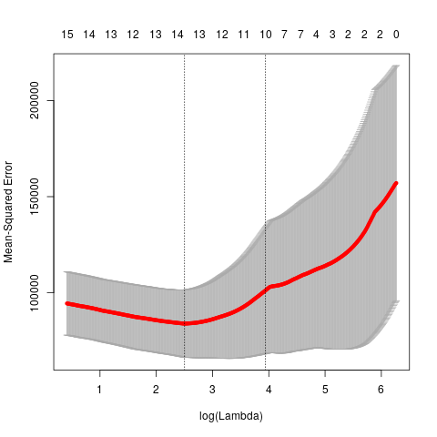

vim: tw=80:
# Homework 8 - Variable Selection

## Question 11.1
Using the crime data set uscrime.txt from Questions 8.2, 9.1, and 10.1, build a 
regression model
using:  
  1. Stepwise regression
  2. Lasso
  3. Elastic net  

For Parts 2 and 3, remember to scale the data first – otherwise, the regression 
coefficients will be on
different scales and the constraint won’t have the desired effect.
For Parts 2 and 3, use the glmnet function in R.
Notes on R:  

  - For the elastic net model, what we called λ in the videos, glmnet calls "alpha"; you can get a
range of results by varying alpha from 1 (lasso) to 0 (ridge regression) [and, of course, other
values of alpha in between].  
  -  In a function call like `glmnet(x, y, family="mgaussian", alpha=1)` 
  the predictors x need to be in R's matrix format, rather than data 
  frame format. You can convert a data frame to a matrix using 
  as.matrix – for example, `x <- as.matrix(data[,1:n-1])`  
  -  Rather than specifying a value of T, glmnet returns models for a variety of values of T.


## Response

We start with loading our libraries, read data and apply some preprocessing.
```R
library(glmnet)

crime <- read.table(
  '../data/uscrime.txt',
  header = TRUE
)

# It's good practice to scale and center predictors in regression
crime[, -ncol(crime)] <- scale(crime[, -ncol(crime)])
```

Now, we need to get a baseline before we can attempt to make any improvements.
Otherwise we won't know how much we improved. 
```R
# Fit simple model
fit <- glm(
  formula = Crime ~ ., 
  data = crime
)
# AIC: 650

print(fit) 
cat(
  "\n",
  "Dev ratio:",
  "\n",
  1-fit$deviance/fit$null.deviance,
  "\n",
  sep=""
)
```

Which gives the following output:
```sh
Call:  glm(formula = Crime ~ ., data = crime)

Coefficients:
(Intercept)            M           So           Ed          Po1          Po2  
    905.085      110.382       -1.822      210.678      572.995     -305.958  
         LF          M.F          Pop           NW           U1           U2  
    -26.826       51.293      -27.906       43.234     -105.056      141.714  
     Wealth         Ineq         Prob         Time  
     92.792      281.954     -110.394      -24.655  

Degrees of Freedom: 46 Total (i.e. Null);  31 Residual
Null Deviance:	    6881000 
Residual Deviance: 1355000 	AIC: 650

Dev ratio:
0.8030868
```

You can see our coeffcients above and our starting Deviance Ratio is starting at
0.8. As reference, closer to 1 is better. Deviance ratio is one minus 
the amount of variance divided by the variance from the null model 
(using just an intercept). Basically, how much of the variance of the null model
were we able to explain with our model. As we remove features we'll expect this
to decrease, but if we can remove say half the features while keeping a similar
dev ratio we have radically simplified our model, avoiding overfitting and
correlations amongst our features. Often, we're able to increase our accuracy on
a test set but with only 47 samples, I do not want to split our data set up.

There are three ways to do
stepwise regression. Forward, Backward and bidirectinal (both). The first two
are computationally more feasible but add bias into their search. For example,
the best one variable model may be using just **y = x<sub>1</sub>**, while the best
two varible model could be **y = x<sub>2</sub> + x<sub>3</sub>**. This is
important because the second model doesn't include x<sub>1</sub>, but forward
selection would never find this because once it determined that x<sub>1</sub>
was in the best single variable model it will never remove it. Backward
selectoin has a similar search pattern. Stepwise helps to by searching more
models but is still not perfect. 

```R
step_stuff <- step(
  fit, 
  direction = "both"  
)

cat("\n", "Step dev ratio", "\n")
slim_fit <- glm(
  Crime ~ M + Ed + Po1 + M.F + U1 + U2 + Ineq + Prob,
  data = crime
)
cat(
  "\n",
  "Dev ratio:",
  "\n",
  1-slim_fit$deviance/slim_fit$null.deviance,
  "\n",
  sep=""
)
```

which gives the following output:

```sh
Step:  AIC=639.32
Crime ~ M + Ed + Po1 + M.F + U1 + U2 + Ineq + Prob
Dev ratio:
0.7888268
```
As you can see our deviance ratio slightly decreased but we were able to
decrease our AIC as well from 650 to 639. This is great, we were able to obtain
a slightly better model with only half the features. We may be able to attribute
the better AIC to the fact that we have similar error and less features as AIC
penalizes for more features.

When using Lasso and the Elastic net if your goal is to minimize error you can
use cross validation and pick the lambda associated with the lowest error
however you define it. In our case I used MSE error. However, because that value
is not guarenteed to be the true best model, and I find a more sparse model more
intersting I use lambda.1se which is the lambda 1 standard error away from the
minimum. Thus,  I'll have less variables in my models.

For the lasso, I was able to maintain a dev ratio of 0.7662658 while sparsing
out five features and shrinking the rest. These are not as great as stepwise in
this case as we are not as sparse or explain as much variance. However, we could
take these variables from the Lasso and now run glm or a ridge regression on
them and we could expect a higher performance result. Often, we can use lasso to
select variables and then use ridge or the Elastic Net to improve performance.
We can see how the error results for the muliple lambdas it used while
attempting to comput the argmin as well as the value of each coefficient for
each lambda. Notice as lambda grows larger and larger all coefficients go to
zero since we are trying to solve a minimization problem.


We see similar results for the error on our Elastic net.


Unfortunetly I didn't set my seed the first few times I ran my code so my code
out put may not match up exactly with my charts if you run it. 

Our Elastic net did not sparse out anymore or less variables but did shrink the
values of each coefficient that we had more. This is an expected result from
adding a L2 error into our minimization.

```sh
(Intercept) 905.085106
M            42.638084
So            4.927139
Ed           17.176815
Po1         172.319414
Po2          91.859692
LF            .       
M.F          55.651000
Pop           .       
NW           17.346096
U1            .       
U2            3.350266
Wealth        .       
Ineq         76.116104
Prob        -61.279744
Time          .       

Elastic Net Dev ratio:
0.652829
```

Unfortunetly, our Dev ratio is starting to get pretty low compared to 0.80. We
shouldn't fret to much since this is on the training data and often vary wildly
from test sets.  Provided I was a better student and realized we had homework
the same week as our midterm quiz I could have spent more time on this and
probably gone back through this and probably re ran everything with a train and
test sets. Alas, one will never know. 

### Code
```R
X <- as.matrix(crime[, -ncol(crime)])
y <- as.vector(crime[, ncol(crime)])

cv_lasso_fit <- cv.glmnet(
  x = X,
  y = y,
  family = "gaussian",
  alpha = 1,  # Lasso
  nlambda = 150,  # 50% more checks than normal
  nfolds = 5,
  type.measure = "mse"
)

print("Lasso Coefficients:")
print("Min Error")
coef(cv_lasso_fit, s = "lambda.min")
print("Lambda with error 1 SE above")
coef(cv_lasso_fit, s = "lambda.1se")

lasso_fit <- glmnet(
  x = X,
  y = y,
  family = "gaussian",
  alpha = 1,  # Lasso
  nlambda = 150  # 50% more checks than normal
)

opt_lasso_fit <- glmnet(
  x = X,
  y = y,
  family = "gaussian",
  alpha = 1,  # Lasso
  lambda = cv_lasso_fit$lambda.1se
)

cat(
  "\n",
  "Lasso Dev ratio:",
  "\n",
  opt_lasso_fit$dev.ratio,
  "\n",
  sep=""
)

cv_fit <- cv.glmnet(
  x = X,
  y = y,
  family = "gaussian",
  alpha = 0.5,  # Lasso
  nlambda = 750,  # 50% more checks than normal
  nfolds = 5,
  type.measure = "mse"
)

net_fit <- glmnet(
  x = X,
  y = y,
  family = "gaussian",
  alpha = 0.5,  # Lasso
  lambda = cv_fit$lambda.1se  # 1se instead of min to get a more sparse result
)

print("Elastic Net coefficients:")
coef(cv_fit, s = "lambda.1se")

# closer to 0 is better
cat(
  "\n",
  "Elastic Net Dev ratio:",
  "\n",
  net_fit$dev.ratio,
  "\n",
  sep=""
)
```

## Helpful Links

  1. Chapter 6 of
  [Introduction to Statistical Learning (ISL)](https://www-bcf.usc.edu/~gareth/ISL/ISLR%20First%20Printing.pdf)
  2. [Glmnet Vignette](http://web.stanford.edu/~hastie/glmnet/glmnet_alpha.html)
  3. Examples from 
  [NCSU](https://www4.stat.ncsu.edu/~post/josh/LASSO_Ridge_Elastic_Net_-_Examples.html)
